# Presentation

## 三角化方法及 PnP 方法

### 实验背景

1. 单目图像缺乏直接深度信息
2. 多视角图像提供视差信息，可用于恢复三维结构
3. 三角化（Triangulation）是通过多个图像中匹配点与相机姿态反推出 3D 点的几何方法
4. 在视觉 SLAM、Structure-from-Motion 等任务中应用广泛

### 实验目标

1. 利用图像序列与已知相机姿态进行三角化估计三维点
2. 构建稀疏深度图或点云，分析其精度
3. 探索匹配误差、姿态误差等对三角化结果的影响

### 数据类型

**数据集 Whole-Apartment**

* **发布机构**：EPFL（瑞士联邦理工学院 Lausanne）
* **主要任务**：室内场景下的深度估计、三维重建、三角化精度分析等。
* **拍摄环境**：一个完整的住宅公寓（Whole Apartment）场景，涵盖多个房间（如客厅、卧室、厨房等）。
* **数据类型**：
  * 彩色图像（RGB）：深度图（Ground Truth Depth）
  * 相机位姿（Camera Poses）：内参（Intrinsics）

### 三角化原理

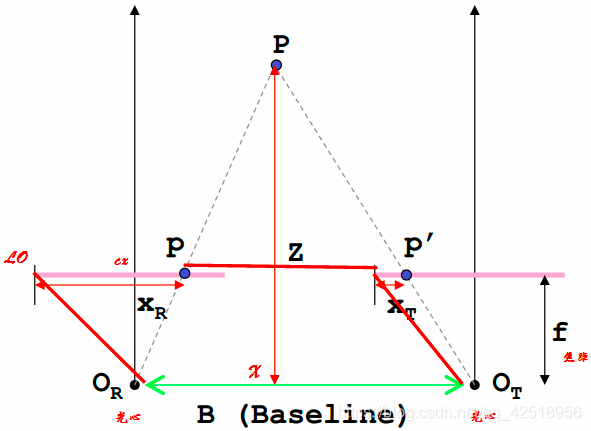

给定两个视角的相机投影矩阵：

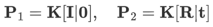

以及对应的图像点：

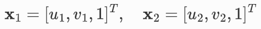

目标是恢复三维点 X，三角化的数学核心是利用两个视角的对应像素点约束，通过解以下线性方程组求解齐次坐标 X：

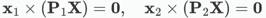

通过对上式用 SVD 求解最小奇异值对应的 X，得到三维点的齐次坐标，再归一化：

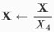

得到：

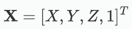

相机 1 坐标系下的深度即为 Z 值。

**三角测量依据的是同一个空间点在不同时刻的投影到相机成像平面上的位置来确定这两个时刻时这个点的深度。**

### 三角化流程

#### 深度图生成与误差评估

将三角化的 3D 点投影到第一帧图像中，将其 Z 值作为重建深度。

与真实深度图进行逐像素比较，计算以下误差指标：

* 相对绝对误差（Abs）
* 均方根误差（RMSE）
* 对数 RMSE（RMSE log）

#### 三角化重建

对匹配点进行像素归一化（使用内参 K 和 `cv2.undistortPoints`）。

构建两个投影矩阵：$P_1= K[I|0]$、$P_2= K[R|t]$

使用 OpenCV 的 `triangulatePoints` 获取三维点坐标。

对三维点进行齐次归一化，过滤掉无效（NaN 或距离过远）点。

#### 计算相对位姿

对每对连续帧 $(i,i+1)$，根据外参计算相对变换：

$$
T_{rel}=T_{i+1}+T_i^{-1}
$$

提取相对旋转 R 和平移向量 t。

#### 特征提取与匹配

使用以下三种方法进行特征提取与匹配：ORB（快速、二进制）、SIFT（尺度不变特征）、SURF（加速鲁棒特征）。

采用 BFMatcher 进行暴力匹配，ORB 使用 Hamming，其余方法使用 L2。

#### 加载相机参数

内参读取：解析焦距 $(f_x, f_y)$ 和主点 $(c_x, c_y)$，生成相机矩阵 K。

外参读取：每三行合成为一个 3×4 姿态矩阵，并扩展为 4×4 齐次矩阵。

### 三角化结果

| 方法 | Abs | RMSE | RMSE log |
| :---: | :---: | :---: | :---: |
| ORB | 1.474 | 3.301 | 1.504 |
| SIFT | 1.34 | 2.989 | 1.819 |
| SURF | 1.448 | 3.068 | 1.851 |

**三角化方法误差来源分析**

* 特征匹配误差
  * 受图像噪声、光照变化等影响，误匹配点参与三角化将导致空间误差。
  * 匹配精度不足（如亚像素级误差）会放大深度估计误差。
* 相对位姿与内参误差
  * 基线过短或视角变化小 → 视差不足，三角化条件不充分。
* 数值不稳定性
  * 极线附近匹配点或退化三角形 → 解空间不稳定、深度不可信。
  * 输出为相对深度 → 缺乏真实尺度，无法获取绝对深度。

### PnP 方法介绍

PnP 问题是指：在已知相机内参的前提下，给定若干个 3D 点及其在图像中的 2D 投影坐标，估计相机的姿态（位置和平移）。

**输入：**

* 相机内参矩阵 $K$
* 一组 3D 世界坐标点 $X_i$
* 对应的图像 2D 点 $x_i$

**输出：**

* 相机位姿：旋转矩阵 $R$、平移向量 $t$
* 得到从世界坐标系到相机坐标系的变换

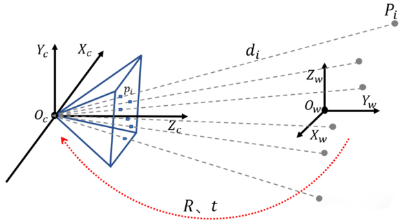

**使用 PnP 方法的优点：**

1. **姿态精度高**：PnP 基于已知的 3D 点和 2D 投影点（而不是从匹配点推导相对位姿），能提供更精确、稳定的相机位姿，特别在基线较小时更鲁棒。
2. **支持真实尺度恢复**：通过 PnP 得到的姿态可带入真实尺度，三角化出的深度也保持绝对尺度一致性。
3. **减少累积误差**：利用已知 3D 点做 PnP 得到准确位姿，再进行三角化可以限制误差传播，提高整体地图构建质量。
4. **鲁棒性强**：PnP 方法结合 RANSAC 使用，对特征点的误匹配具有较强的抗干扰能力。相比之下，直接三角化受误匹配和本质矩阵误差影响更大。
5. **适用于多帧融合**：可以在一个局部窗口中多帧联合优化 PnP 姿态，再统一进行三角化，提升深度估计稳定性（如 Sliding Window BA）。

### PnP 方法流程

#### 深度图生成与误差评估

将三角化的 3D 点投影到第一帧图像中，将其 Z 值作为重建深度。

与真实深度图进行逐像素比较，计算以下误差指标：

* 相对绝对误差（Abs）
* 均方根误差（RMSE）
* 对数 RMSE（RMSE log）

#### 三角化重建

对匹配点进行像素归一化（使用内参 K 和 `cv2.undistortPoints`）。

构建两个投影矩阵：$P_1= K[I|0]$、$P_2= K[R|t]$

使用 OpenCV 的 `triangulatePoints` 获取三维点坐标。

对三维点进行齐次归一化，过滤掉无效（NaN 或距离过远）点。

#### 位姿估计（PnP）

使用提取到的 3D-2D 点对，调用 OpenCV 的 `solvePnPRansac` 函数，估计第二张图像相对于第一张图像的旋转（R）和平移（t）；

设置迭代次数、投影误差阈值等参数以提高鲁棒性；

若 R 矩阵不合法或 t 过大，放弃该图像对。

#### 3D 点提取

对第一张图像的匹配点，根据深度图中的深度值和相机内参，将其反投影为三维空间中的点 $(X, Y, Z)$；

舍弃无效深度点或超出范围的点（如 $<0.1m$ 或 $>100m$）；

保留有效的 3D-2D 对应关系，为后续 PnP 准备数据。

#### 数据加载与特征提取与匹配

与三角化内容相同。

### PnP 方法后三角化结果及分析

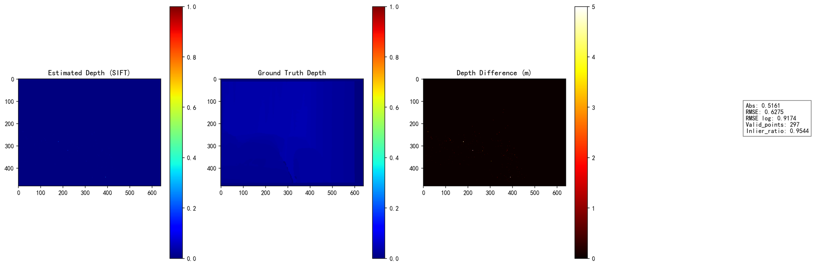

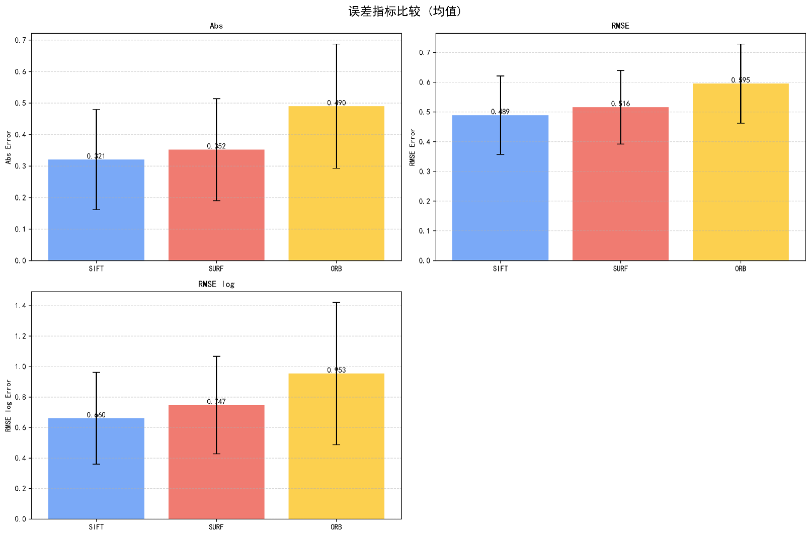

| 方法 | Abs | RMSE | RMSE log | 点数 | 时间 |
| :---: | :---: | :---: | :---: | :---: | :---: |
| SIFT | 0.3206 | 0.4891 | 0.66 | 206 | 0.1 |
| SURF | 0.3521 | 0.5157 | 0.7469 | 296 | 0.08 |
| ORB | 0.4899 | 0.5951 | 0.953 | 886 | 0.06 |

* **精度方面**：SIFT 在所有三个误差指标（Abs、RMSE、RMSE log）上表现最佳，说明其特征点匹配更稳定，误差更小。SURF 次之，ORB 精度相对较低，特别是在对数误差方面（0.9530），表现出较明显的估计偏差。
* **鲁棒性方面**：ORB 能够提取更多的匹配点（有效点数高达 886），显著高于 SIFT 和 SURF，这说明 ORB 更适用于纹理丰富或图像噪声较大的场景。但也由于点数过多且不够精确，误差指标上偏高。
* **计算效率方面**：ORB 平均处理时间最低，仅为 0.06 秒/对，适合实时处理需求；SIFT 和 SURF 略慢，分别为 0.10 和 0.08 秒/对。
* **精度-效率权衡**：若关注深度估计精度，推荐使用 SIFT；若在实时性要求较高或大规模处理中使用，ORB 是较好的选择；SURF 作为折中方案，兼顾一定精度与效率。

## DELTAS 方法复现及改进

### DELTAS 方法简介

DELTAS 是一种高效的多视图深度估计算法，旨在在无需构建代价体（Cost Volume）的前提下实现准确、低计算成本的深度估计。传统基于代价体的多视图立体视觉方法尽管精度较高，但计算资源开销大，不适用于资源受限的场景，例如移动设备或 AR / VR 系统。为此，DELTAS 提出了一种三阶段的深度估计框架：

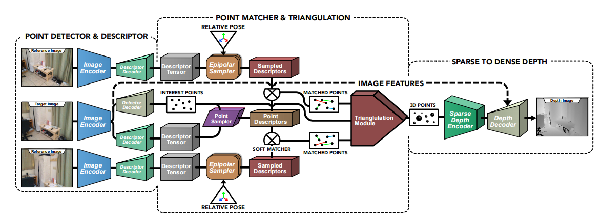

#### 兴趣点检测与描述

输入图像经过图像编码器（Image Encoder）提取特征后，分别送入两个解码头：

* **Detector Decoder**：负责生成图像中的兴趣点热图（Interest Points）。
* **Descriptor Decoder**：输出每个像素位置的特征描述子张量（Descriptor Tensor）。

该模块与 SuperPoint 架构类似，但使用了更深的主干网络（如 ResNet-50），以增强下游密集深度估计能力。

#### 点匹配与三角测量

目标图像中的兴趣点经过 Point Sampler 筛选，并提取对应的描述子。

利用相对位姿（Relative Pose），将兴趣点投影到辅助视角图像中，仅在其极线范围内进行描述子采样（Epipolar Sampler），显著减少匹配计算量。

匹配结果通过 Soft Matcher 得到多个视角下的点对。

所有匹配点被送入可微分的三角测量模块（Triangulation Module），通过代数解法估算每个兴趣点对应的三维坐标，最终生成稀疏的 3D 点云。

#### 稀疏到稠密深度补全

三角测量得到的稀疏深度图输入一个浅层的稀疏深度编码器（Sparse Depth Encoder），提取稀疏几何特征。

该特征与图像编码器输出特征一起输入到 U-Net 风格的深度解码器（Depth Decoder），最终输出完整的稠密深度图（Depth Image）。

整体训练过程为端到端，并在多个尺度上添加监督，提升预测精度与边缘细节还原能力。

### 数据集处理

论文中提供的代码所使用的数据集格式与 whole_apartment 不符，我们对 whole_apartment 数据集进行以下处理：

**数据集划分**：whole_apartment 数据集位姿数据存储在一个 txt 文件中，而论文代码中每一张图片位姿数据都存储在一个单独的 txt 中，因此我们对 whole_apartment 数据集中的位姿数据进行了划分。

另外图片命名序号等也做了重新排列。

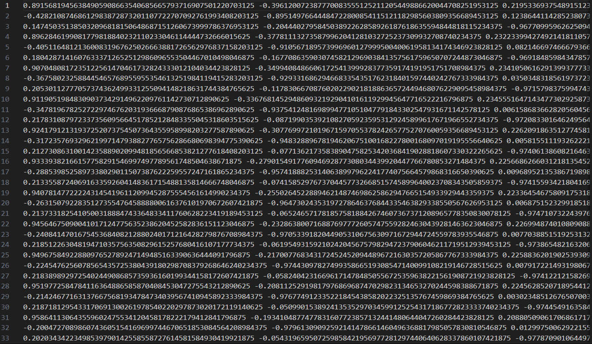

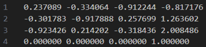

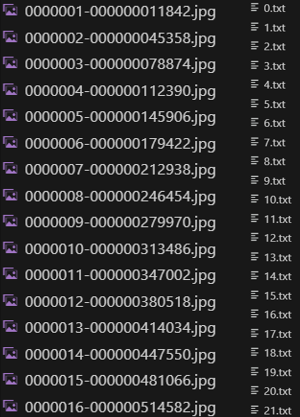

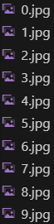

### 实验设计

**参数设计：**

| 序列长度 | 序列间隔 |
| :---: | :---: |
| 3 | 20 |
| 4 | 15 |
| 5 | 12 |
| 7 | 10 |

**参数设计原则：**

论文在 4.1 节提到：Three views from a scan at a fixed interval of 20 frames along with the pose and depth information forms a training data point in our method.

即每个样本由三帧图像组成，它们在原始视频序列中间隔 20 帧，用于构建锚帧 + 两参考帧的三视图结构，便于多视图匹配与三角化。

此外，论文中还提到：These gaps ensure that each set approximately spans similar volumes in 3D space, and any performance improvement emerges from the network better using the available information as opposed to acquiring new information.

虽然序列长度变多，但通过缩短帧间隔（gap），保持总视角跨度基本一致，以便公平比较更多视图是否对网络性能有提升。

### 实验数据

我们使用上述参数进行多轮测试，得到了以下数据：

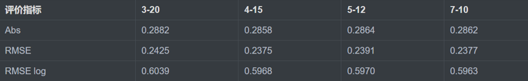

**实验结果分析：**

* **整体趋势**：
  1. 更多帧数和更小间隔略有提升；
  2. 随着序列长度从 3 增加到 7，且帧间隔从 20 减小到 10；
  3. Abs 几乎保持不变，略有下降；
  4. RMSE 和 RMSE log 均略有下降，尤其是 RMSE，从 0.2425 → 0.2375。
* **说明**：
  1. 更长的序列（更多图像视角）和更小的间隔（更强的帧间几何约束）确实能提供更多冗余信息，有助于三角化得到更稳健的稀疏点，进而提升稠密深度图的质量；
  2. 但提升有限，表明 DELTAS 在 seq=3、gap=20 时已有较强性能，对帧数和间隔不敏感，具备较好鲁棒性。
  3. 从 3→4→5→7 帧的过程中，性能略有提高但不是线性，说明：
     * 性能提升的边际效益递减，说明超过 5 帧可能性价比低；
     * 如果系统资源有限，可以使用 3-5 帧 + 12-15 帧间隔，在精度和效率之间取得平衡。

**与论文结果对比：**

论文中表 3 提到 DELTAS 在 ScanNet 数据集上的表现如下（Abs、RMSE 和 RMSE log）：

* 3-20：Abs ≈ 0.106，RMSE ≈ 0.173，RMSE log ≈ 0.057
* 4-15：Abs ≈ 0.090，RMSE ≈ 0.150，RMSE log ≈ 0.049
* 5-12：Abs ≈ 0.088，RMSE ≈ 0.147，RMSE log ≈ 0.048
* 7-10：Abs ≈ 0.087，RMSE ≈ 0.144，RMSE log ≈ 0.043

相比于论文结果，实验数据约在同一个数量级上，但是表现仍明显差于论文在 ScanNet 数据集上的表现。

分析：DELTAS 泛化性能略差。

### 改进 1

#### 问题背景

原始 DELTAS 方法的关键点来源于 Detector（如 SuperPoint），它通常集中在纹理丰富、角点突出的区域（如物体边缘、墙角），但对于纹理弱或光滑区域（如白墙、地板）基本无关键点，这导致稀疏三角化点分布不均匀，部分区域无深度监督。

#### 改进目标

1. 让关键点覆盖整个图像区域，包括低纹理区域
2. 改善稀疏 - to - 稠密模块的训练效果，提高整体深度图精度

#### 实现思路

1. 保持原有 Detector 的关键点（如 256 个）
2. 从图像中随机均匀采样额外关键点（如再加 256 个）
3. 将这两部分合并，作为三角化的输入关键点

### 改进 2

#### 问题背景

深度图中常见在图像边缘（如物体边界）处预测模糊网络在边缘处趋向过度平滑，丢失结构细节的问题。

#### 改进目标

1. 保持图像边缘处的深度跳变（物体之间的真实距离差）
2. 在平滑区域（背景、墙面）内继续保持平滑

#### 实现思路

计算像素之间深度差，但根据图像内容调整平滑力度:

1. 如果图像边缘明显，说明该位置属于结构边界 → 不强制平滑
2. 如果图像边缘变化小，则加强平滑，去除深度噪声

### DELTAS 复现结论

1. 在 whole_apartment 数据集上性能相比于三角化方法和 PnP 方法明显效果更加良好。
2. 增加帧数或减小帧间时间间隔对 DELTAS 性能有一定提升，但改善效果有限。
3. 在 whole_apartment 数据集上的性能下降明显，说明模型在未知环境下的泛化能力仍有待提升。

## 遇到的困难及解决方法

### PnP 方法和三角化估计阶段

1. **数据库获取困难**：下载速度极慢 / 不稳定。
2. **OpenCV 版本问题**：OpenCV 默认不支持 SIFT / SURF。
3. **三角化点全堆叠在一起**：三维点投影呈现一条线或扁平结构，无有效深度分布。图像对视觉差过小，难以反映深度。

### 模型在 whole_apartment 数据集上表现较差

在复现初期，我们发现 DELTAS 模型在 whole_apartment 数据集上的深度估计效果很差，如下所示：

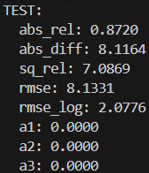

经过排查，我们最终发现根本原因在于原始深度图未进行右移操作（bit shift）。whole_apartment 数据集中的深度图通常以 16 位无符号整数（uint16）格式存储，其单位为毫米，但为了节省存储空间，部分数据实际被以 depth >> 3 的形式编码。如果直接读取而未右移三位，则所有深度值会被误解释为原来的 1/8，从而严重影响三角测量的结果。

修复方法是在数据预处理阶段对深度图执行右移三位（depth = depth >> 3），恢复真实深度数值后重新训练，模型性能显著改善，稀疏点和稠密预测结果均趋于正常。

这个问题暴露出在跨数据集复现中，数据格式与语义细节（如 bit shift、单位、空值标记）必须严格对齐原始设定，否则模型可能无法学习到有效表示，甚至完全失效。

## 总结与心得

### 理论结合实践深化理解

通过三角化与 PnP 实验，我们系统掌握了计算机视觉中几何方法估计深度的核心思想，加深了对本质矩阵、投影矩阵与坐标变换的理解，也认识到实际图像中的特征提取、匹配误差等对三角化质量的显著影响。

### 工程实现能力得到提升

整个项目中涉及 OpenCV、NumPy、Matplotlib 等多个工具的联合使用，这一过程锻炼了我们对图像处理流程、相机模型、坐标变换与可视化方法的综合运用能力。

### 深度学习模型复现带来成长

DELTAS 网络的复现经历了模型权重下载、依赖环境配置、图像预处理标准化、结果评估指标复现等技术挑战。通过查阅论文与代码，我们逐步掌握了神经网络在深度估计中的应用，获得了宝贵的实践经验。

### 对深度估计任务有了更全面认知

通过对比三角化、PnP 和 DELTAS 三种方法的优缺点，这为我们未来研究和应用提供了方向指引。